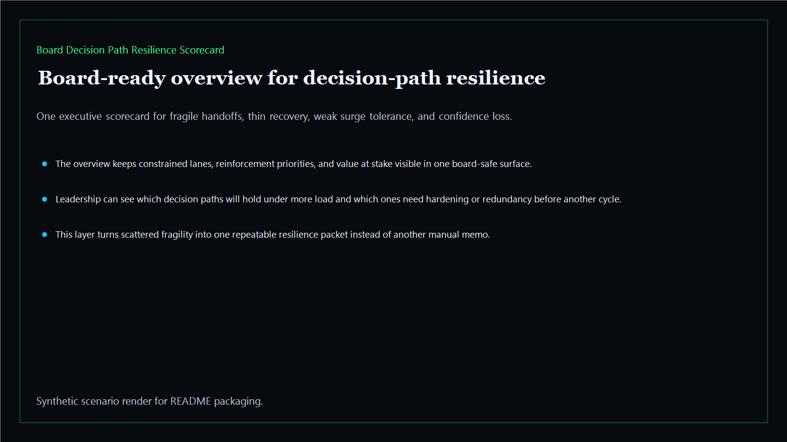
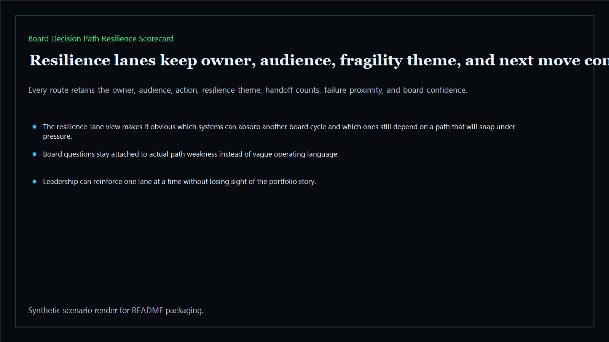
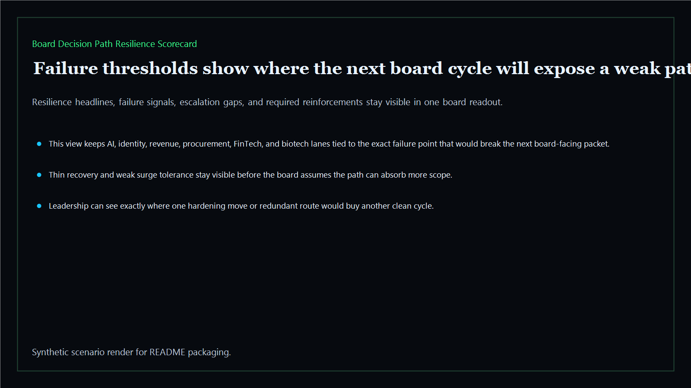
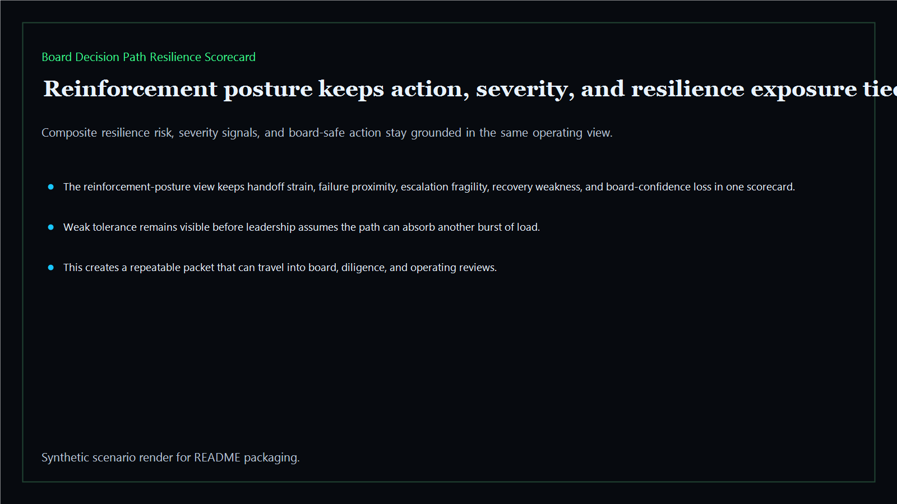

# Board Decision Path Resilience Scorecard

Board-ready path-resilience scorecard for tracking whether a decision path can absorb another cycle without fresh breakage, delay, or confidence loss.

- Live: `https://resilience.kineticgain.com/`
- Repo: `mizcausevic-dev/board-decision-path-resilience-scorecard`

## Why this matters

Leaders need more than a point-in-time integrity readout. They need one scorecard that shows which decision paths will hold under more load, which ones will snap on the next cycle, and where resilience investment belongs first.

## What it includes

- TypeScript executive-intelligence surface for path-resilience scoring with modeled executive lanes, fragility thresholds, and board-safe reinforcement posture
- synthetic executive lanes across AI, identity, revenue, FinTech, biotech, procurement, and public-sector readiness
- reusable outputs for resilience lanes, failure thresholds, reinforcement packets, and board-ready operating memos
- prerendered static site, JSON payloads, screenshots, and docs

## Routes

- `/`
- `/resilience-lanes`
- `/failure-thresholds`
- `/reinforcement-posture`
- `/verification`
- `/docs`

## Local run

```bash
cd board-decision-path-resilience-scorecard
npm install
npm run verify
npm run prerender
npm run render:assets
```

## CLI

```bash
npx board-decision-path-resilience-scorecard fixtures/board-decision-path-resilience-scorecard.json --format summary
npx board-decision-path-resilience-scorecard fixtures/board-decision-path-resilience-scorecard-clean.json --format json
```

## Docs

- [Architecture](docs/architecture.md)
- [Origin](docs/ORIGIN.md)
- [Kinetic Gain Embedded](docs/KINETIC_GAIN_EMBEDDED.md)

## Screenshots





